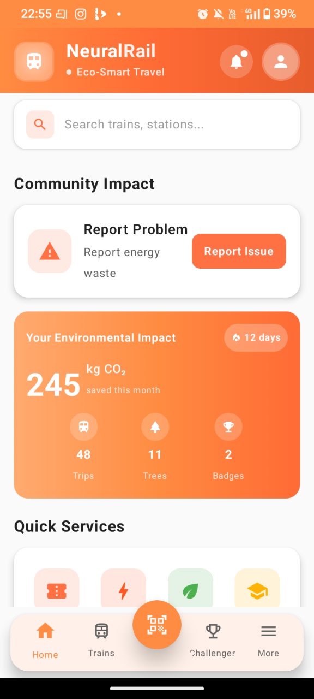

# NeuralRailApp

**NeuralRailApp** is a cutting-edge Android application designed to enhance the Indian Railways experience through AI-driven insights and eco-friendly initiatives. Built for the NeuroNexus hackathon, it leverages Google's **Gemini 1.5 Flash** for analyzing energy wastage reports and utilizes **ML Kit** for seamless QR code interactions.

---

## 📱 Features

### 1. 🤖 AI-Powered Energy Wastage Reporting
- **Smart Analysis**: Users can report energy wastage (e.g., lights left on, water leakage) by providing a description and location.
- **Gemini Integration**: The reports are analyzed in real-time by Google's Gemini AI to:
  - Classify the severity (Low/Medium/High).
  - Verify the validity of the report.
  - Provide actionable recommendations for mitigation.
- **Status Tracking**: Reports are tracked with statuses like `PENDING`, `RESOLVED`, and `VERIFIED`.

### 2. 📷 Universal QR Scanner
- **One Scanner for All**: A unified scanner that identifies and processes different types of Railway QR codes:
  - **Train Information**: Displays real-time status (e.g., "On Time", "Delayed"), train name, and number.
  - **Ticket Verification**: Decodes PNR status and confirmation details.
  - **Station Info**: Provides amenities and platform details for specific stations.

### 3. 🌿 Eco-Commute & Challenges (Demo Features)
- **Gamification**: Users can participate in eco-challenges to earn rewards.
- **Carbon Footprint Tracking**: Visualizes the environmental impact of choosing rail travel over other modes.

---

## 🛠️ Tech Stack

- **Language**: Kotlin
- **UI Framework**: Jetpack Compose (Material Design 3)
- **Architecture**: MVVM with Clean Architecture principles
- **AI/ML**: 
  - **Google Gemini 1.5 Flash** (Generative AI)
  - **CameraX + ML Kit** (Barcode Scanning)
- **Backend (Simulation)**:
  - **Firebase Firestore**: Integrated for data persistence.
  - **Graceful Degradation**: The app is designed to function even without valid Firebase credentials (using a local mock fallback) for demonstration purposes.

---

## 🚀 Getting Started

### Prerequisites
- **JDK 17**: This project requires Java Development Kit 17.
- **Android Studio**: Ladybug or newer recommended.

### Installation

1. **Clone/Unzip** the repository.
2. **Open** the project in Android Studio.
3. **Build the APK**:
   ```bash
   ./gradlew installDebug
   ```
   > **Note**: A pre-compiled APK (`NeuralRailApp-Debug.apk`) is available in the root directory for quick testing.

### Configuration
- **Gemini API Key**: The project is pre-configured with a valid API Key for the hackathon (in `GeminiService.kt`).
- **Firebase**: If you wish to use a real Firestoe backend, place your `google-services.json` in the `app/` directory. If missing, the app will automatically switch to **Mock Mode**.

---

## 🧪 Testing Guide

### Testing QR Codes
Since physical QR codes might not be available, a suite of **Test QR Codes** has been generated for you in the `qr/` folder at the root of the project:

| File Name | Description | Expected Result |
|-----------|-------------|-----------------|
| `1_train_vandebharat_ontime.png` | Train Info | Shows "Vande Bharat Express" - On Time |
| `2_train_rajdhani_delayed.png` | Train Info | Shows "Rajdhani Express" - Delayed |
| `3_train_rajdhani_basic.png` | Train Info (No Status) | Shows generic info |
| `4_ticket_confirmed.png` | Picket PNR | Shows "Confirmed" status |
| `5_station_mumbai.png` | Station Info | Shows Mumbai Central details |

**How to test**:
1. Open the images on your laptop/PC screen.
2. Open the **Scanner** tab in the app.
3. Point the phone camera at the screen.

### Testing AI Reports
1. Navigate to **More > Energy Wastage Report**.
2. **Description**: "Fan running in empty waiting room".
3. **Location**: "Platform 4".
4. Tap **Analyze with AI**.
5. Observe the AI's classification and recommendation.

---

## 📸 Screenshots

| | | |
|:---:|:---:|:---:|
|  |  |  |
|  |  | |

---
*Built with ❤️ 
