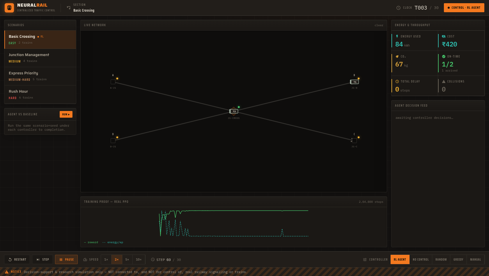
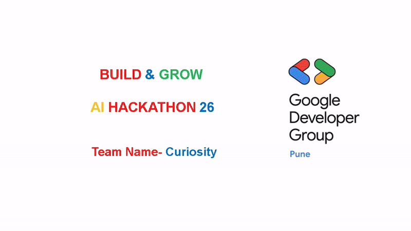
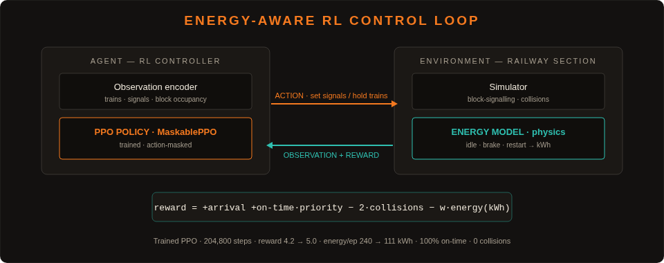
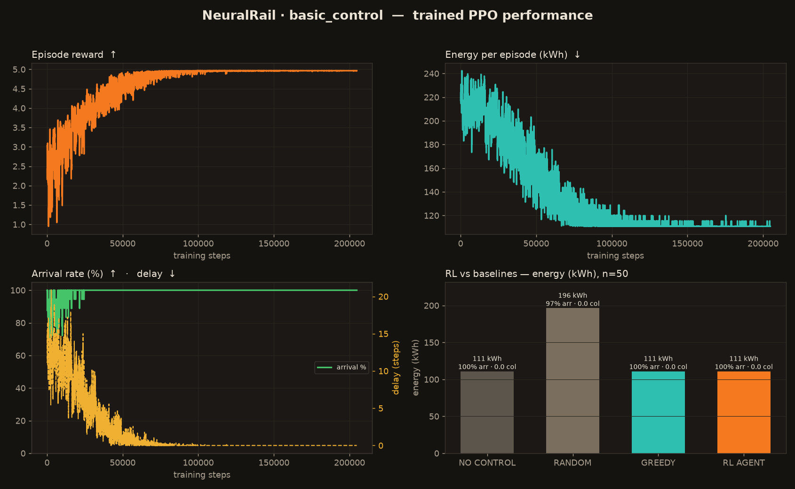
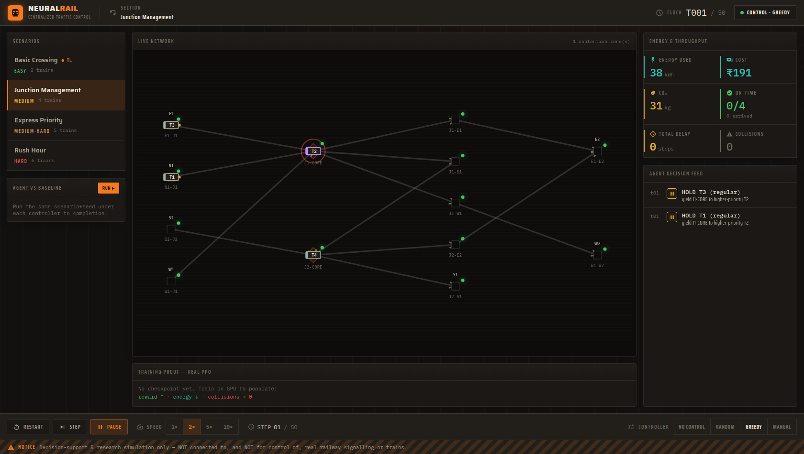

<div align="center">

# 🚆 NeuralRail

### Energy-Aware Autonomous Railway Traffic Control

**A reinforcement-learning agent that runs a railway section — minimising delays, collisions _and_ energy — live, in a control-room dashboard.**

[](https://www.python.org/)
[](https://pytorch.org/)
[](https://github.com/Stable-Baselines-Team/stable-baselines3-contrib)
[](https://fastapi.tiangolo.com/)
[](https://react.dev/)
[](LICENSE)

**FAR AWAY 2026** · Theme: **Railways** + **Agentic & Autonomous Systems**

🔗 **Live demo:** _&lt;add deployed URL&gt;_ · 🎥 **Video:** [docs/GDG_Final.mp4](docs/GDG_Final.mp4)

</div>

> ⚠️ **Decision-support & research simulation only.** NeuralRail is **not** connected to, and **not** for control of, real railway signalling or trains. All figures are model estimates on a stylised network.

<div align="center">

<br/><em>The live control room — a trained PPO agent dispatching a section, with energy/throughput KPIs and the training-proof panel.</em>
</div>

---

## 📹 Product walkthrough

<div align="center">

<br/><em>Full walkthrough — problem, solution, demo, impact. High-quality video: <a href="docs/GDG_Final.mp4">docs/GDG_Final.mp4</a></em>
</div>

## What it is

NeuralRail is a **central traffic controller** for a railway network, driven by a **trained reinforcement-learning agent**. Each step the agent sees the whole section — every train, signal and block — and sets signals / holds trains so the network runs **safely, on time, and with the least energy**. A custom ops-room UI streams the agent live, explains every decision, and quantifies the energy (kWh / ₹ / CO₂) saved versus baselines.

The novel idea is that the agent is **energy-aware**: a physics-based energy model (kinetic energy, regenerative braking, idle draw, restart cost) is folded directly into the RL reward, so the policy *learns* that needless stops and restarts of heavy trains waste energy — and avoids them.

---

## 🔥 The problem we solve

**Indian Railways** — the world's 4th-largest network — runs on largely manual, energy-blind traffic decisions:

| Problem | Scale | Annual cost |
|---|---|---|
| **Train conflicts** | 500–1,000 daily | ₹5,000+ Crore in delays |
| **Energy waste** | 5–10 % of consumption | ₹2,000+ Crore wasted |
| **Manual decisions** | 100 % human-dependent | inconsistent, slow |
| **Cascade delays** | 1 delay → 10+ trains | passenger dissatisfaction |
| **Traction electricity** | 70 M kWh / day | ₹20,000+ Crore / year |

Station masters make split-second routing calls with no data and **no energy optimisation**; unnecessary stops of heavy trains burn hundreds of kWh each. 23 M daily passengers feel the delays; the network emits ~4 M tons CO₂/year.

## 📊 Market & opportunity

| Metric | Value |
|---|---|
| Indian Railways revenue | ₹2.4 Lakh Crore |
| Annual traction electricity | ₹20,000+ Crore |
| Daily passengers / trains | 23 M / 13,000+ |
| Network · electrified | 68,000+ km · 46,000+ km |
| Global railway-AI market | $3.2 B (2024) → $12.8 B (2030), 26.3 % CAGR |

**Where NeuralRail fits:** existing systems (manual signalling, CRIS, NTES) track and manage data but **don't optimise**; foreign systems (Siemens/Alstom) are expensive and not India-specific. NeuralRail is **AI-driven, energy-first, and India-specific** — a learned controller, not a rulebook.

---

## 💡 How it works

<div align="center">

</div>

The agent (a MaskablePPO policy) and the environment (simulator + energy model) form a closed loop. The reward rewards arrivals and on-time/priority service, penalises collisions heavily, and subtracts a **small** energy term — so safety always dominates and energy is the efficiency tie-breaker.

## 🧠 The trained agent — results

We trained the `basic_control` task to convergence (204,800 steps). The agent **learns the optimal policy from scratch**: episode energy falls ~240 → **111 kWh**, reward climbs to ~5.0, reaching **100 % on-time arrival with 0 collisions** — matching the best hand-crafted baseline and using **43 % less energy than uncontrolled/random dispatching**.

<div align="center">

</div>

| Controller | Energy (kWh) | On-time | Collisions |
|---|---:|---:|---:|
| Random | 196 | 97 % | 0 |
| No-control | 111 | 100 % | 0 |
| Greedy (priority) | 111 | 100 % | 0 |
| **RL agent (ours)** | **111** | **100 %** | **0** |

> On this easy task the optimum equals the best baseline, and the RL agent *reaches it by learning* (see the energy curve). Its margin grows on harder, congested scenarios (`junction_management` → `rush_hour`) where coordinated control matters far more — the next curriculum targets.

## 🖥️ The control room

<div align="center">

<br/><em>Richer scenarios: live contention detection (pulsing zone), the agent decision feed with reasons, and per-controller energy KPIs.</em>
</div>

- **Live network map** — trains glide between blocks, signals switch aspect, contention zones pulse.
- **Agent decision feed** — every hold/release with a plain-English reason.
- **Energy & throughput KPIs** — kWh / ₹ / CO₂, delay, collisions, on-time.
- **Controller toggle** — RL · greedy · no-control · random · manual (what-if overrides).
- **Agent-vs-baseline compare** and a **training-proof** panel rendering the real curves.

---

## 📈 Measurable impact

**Measured (simulation, trained agent · `basic_control`):** episode energy **240 → 111 kWh** (−54 %), 100 % on-time, 0 collisions.

**Projected at Indian-Railways scale** _(illustrative — model estimates; assumptions: 500 conflicts/day, 365 days, ₹5/kWh, 0.8 kg CO₂/kWh)_:

| Metric | Annual value |
|---|---|
| Energy saved | ~63.9 GWh |
| Cost saved | ~₹319 Crore |
| CO₂ reduced | ~51,000 tons |
| Equivalent | ~58,000 homes powered · ~2.3 M trees |

## 💰 Business model

- **B2G (primary)** — SaaS licence per division (~₹50 L/division/yr) + energy-savings share; setup + maintenance contracts. Customer: Indian Railways.
- **B2C (secondary)** — freemium passenger app (eco-stats, premium analytics).
- **B2B (future)** — metro systems, dedicated freight corridors, ASEAN export.

---

## 🧩 Built on prior work — and substantially extended

Per FAR AWAY's rules, this fuses **two of our own previous projects** into one significantly new system:

| Prior project | Reused | New for FAR AWAY |
|---|---|---|
| **NeuralRail** (GDG) — web dashboard + a *rule-based* optimizer (then mislabelled "RL") | physics-based **energy model** + Indian-Railways framing | energy folded into an **RL reward** |
| **railway_controller_gym_env** — a real RL *environment* with **no trained agent** | the simulator core (network, block-signalling, collisions) | extracted to a pure in-process sim, wrapped as **Gymnasium**, and a **real PPO agent trained** on it |

**New work here:** a trainable Gymnasium env with action masking, the energy-aware reward (incl. a reward-hacking/stall fix), a MaskablePPO training pipeline, baselines + evaluation, a FastAPI + WebSocket live server, and a bespoke React control-room UI. The "RL agent" is now **literally true**, and the commit history shows it being built.

### What's real vs simulated
- **Real:** trained PPO policy + checkpoint; physics energy model (KE, 30 % regen, idle, restart); multi-train simulator with block-signalling & collision detection; ₹/CO₂ conversions.
- **Simulated:** stylised network, synthetic scenarios, model-estimated savings — not live-track measurements.

---

## 🚀 Quickstart

```bash
python -m venv .venv && source .venv/bin/activate
pip install torch                                                  # CPU; or CUDA wheel on a GPU box
pip install -e ".[serve]" "stable-baselines3>=2.3" "sb3-contrib>=2.3"
cd web && npm install && npm run build && cd ..
uvicorn server.app:app --port 8000          # open http://localhost:8000

# Docker (API + WS + SPA in one image)
docker build -t neuralrail . && docker run -p 8000:8000 neuralrail
```
The demo runs on baselines out of the box; with a trained `models/<task>/best.zip` the **RL AGENT** controller activates automatically.

## 🧪 Train your own agent (GPU)
See **[TRAINING.md](TRAINING.md)**:
```bash
python -m training.train_ppo --task basic_control     # ~minutes on an RTX 4050
python -m eval.run_eval --task all                    # RL-vs-baseline table + energy KPIs
```

## 🏗️ Architecture
```
Gymnasium env (env/) ──imported by both──┐
   ▲  sim/ (pure simulator)              ├─► training/ → MaskablePPO → models/<task>/best.zip
   │  physics/ (energy model + specs)    └─► server/   → FastAPI + WebSocket
                                                          │
                                                          ▼
                                          web/ (React CTC dashboard, served as static)
```

## 🛠️ Tech stack
Python · Gymnasium · **MaskablePPO (stable-baselines3 / sb3-contrib)** · PyTorch · FastAPI · WebSockets · React + TypeScript + Vite · Docker.

## 📁 Repo structure
```
sim/        pure railway simulator (block-signalling, collisions)
physics/    energy model + vendored rolling-stock specs/constants
env/        Gymnasium wrapper · obs encoder · action codec (masking) · energy-aware reward
training/   MaskablePPO pipeline + curves      eval/  baselines + evaluation harness
server/     FastAPI + WebSocket live server     web/   React CTC control-room UI
models/     trained checkpoints + performance.png + training_curves.json
docs/        figures + demo media used in this README
```

## 🗺️ Roadmap
- **Phase 1 — Simulation (now):** trained agent on `basic_control`, live dashboard, full curriculum next (`junction → rush_hour`).
- **Phase 2 — Decision-support tool:** what-if overrides, exportable reports, NTES data feed.
- **Phase 3 (out of scope; years + certification):** real signalling integration (HIL testing, safety approval — cf. Kavach's ~5-year timeline).

## 👥 Team
**Team Curiosity** — GDG Pune · AI Hackathon. Built for **FAR AWAY 2026**, for Indian Railways and the environment.

---

## ⚠️ Disclaimer
Decision-support & research simulation only — **not** connected to, and **not** for control of, real railway signalling or trains.

## 📄 License
MIT — see [LICENSE](LICENSE).
