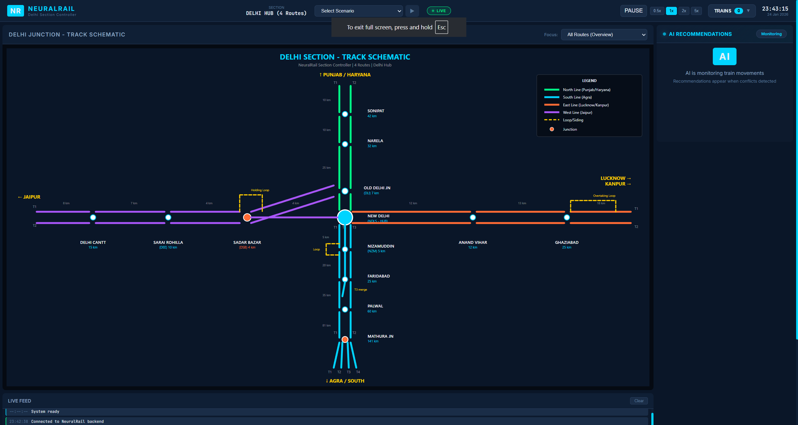
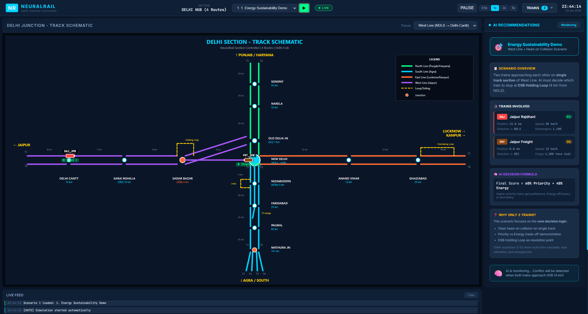
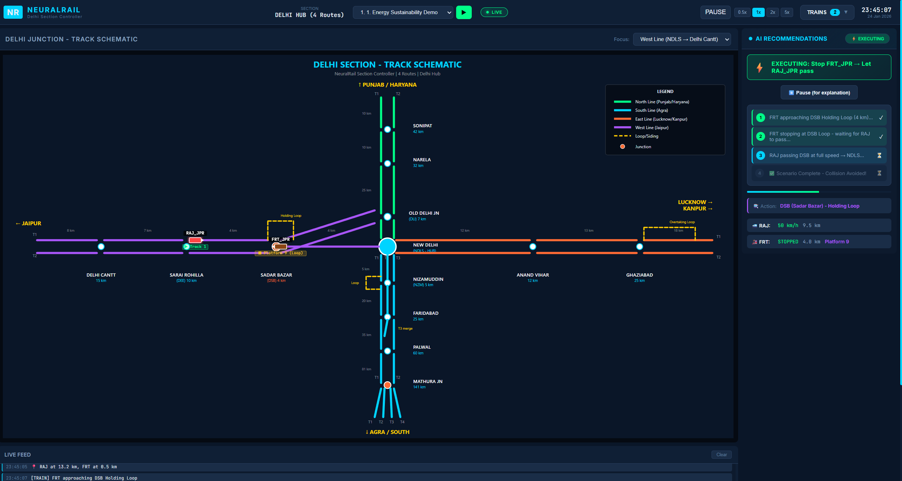
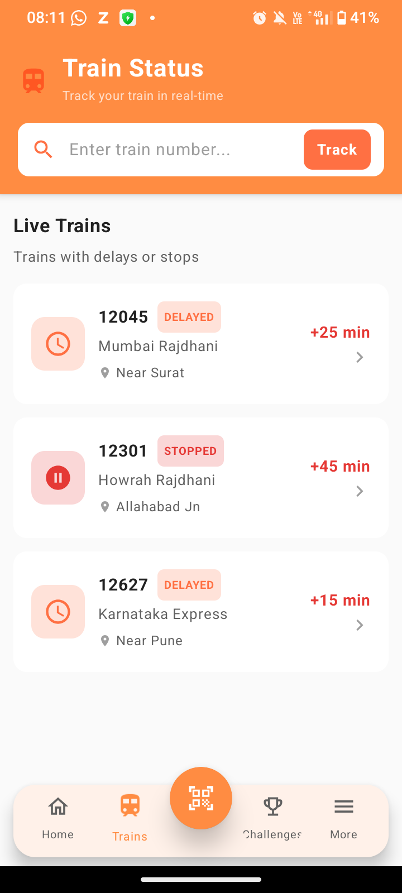
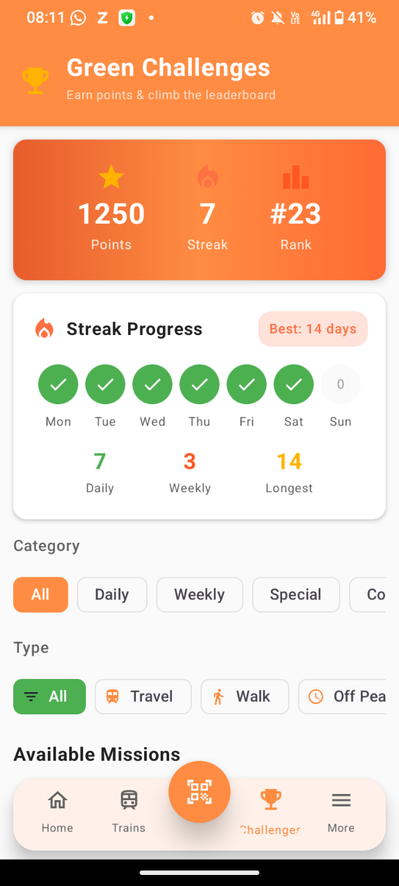
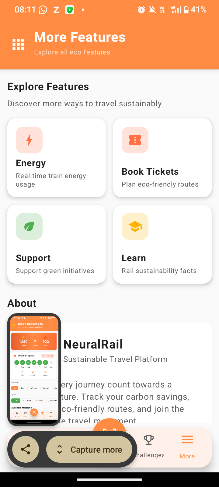
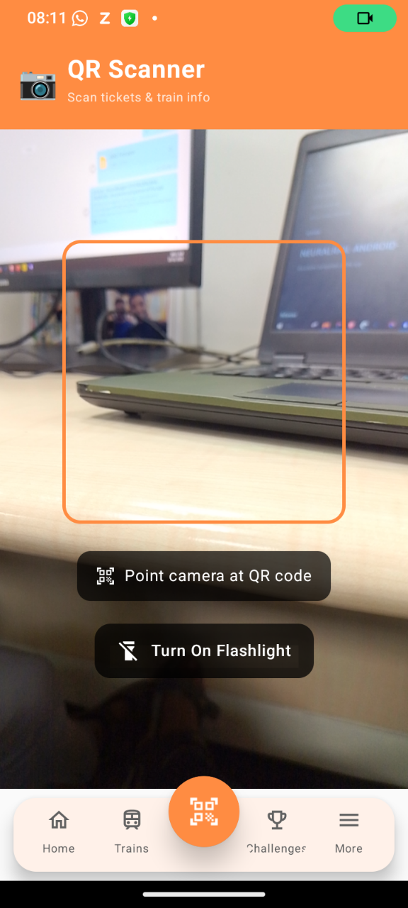

# 🚄 NeuralRail - AI-Powered Railway Traffic Optimization System

<div align="center">



**Reducing Railway Delays & Energy Waste Through Artificial Intelligence**

[](https://www.python.org/)
[](https://kotlinlang.org/)
[](https://ai.google.dev/)

[🎥 Watch Demo Video](#-product-demo) • [📱 Android App](#-android-app) • [🖥️ Web Dashboard](#-web-dashboard) • [📊 Impact](#-measurable-impact)

</div>

---

## 📋 Table of Contents
- [The Problem](#-the-problem-we-solve)
- [Market Research](#-market-research--opportunity)
- [Our Solution](#-our-solution)
- [Why We Built This](#-why-we-built-this)
- [Product Demo](#-product-demo)
- [Technology](#-technology-architecture)
- [Measurable Impact](#-measurable-impact)
- [Traction](#-traction--validation)
- [Business Model](#-business-model)
- [Roadmap](#-roadmap)
- [Team](#-team)

---

## 🔥 The Problem We Solve

### Indian Railways: A ₹2.4 Lakh Crore Giant with Critical Inefficiencies

**Indian Railways** is the world's 4th largest railway network, but faces massive operational challenges:

| Problem | Scale | Annual Cost |
|---------|-------|-------------|
| **Train Conflicts** | 500-1,000 daily | ₹5,000+ Crore in delays |
| **Energy Waste** | 5-10% of consumption | ₹2,000+ Crore wasted |
| **Manual Decisions** | 100% human-dependent | Inconsistent, slow |
| **Cascade Delays** | 1 delay = 10+ trains affected | Passenger dissatisfaction |
| **Electricity Bill** | 70M kWh daily | ₹20,000+ Crore annually |

### Real-World Impact on Stakeholders

**🚂 Railway Operations:**
- Station masters make split-second decisions without data
- No energy optimization in conflict resolution
- Priority violations cause VIP train delays
- Manual coordination leads to human errors

**👥 Passengers (23 Million Daily):**
- Unpredictable delays
- Missed connections
- No transparency on delay reasons
- Frustration with service quality

**🌍 Environment:**
- 4 Million tons CO₂ annually
- Massive energy waste in unnecessary stops
- Regenerative braking potential unused

---

## 📊 Market Research & Opportunity

### Market Size


| Metric | Value | Source |
|--------|-------|--------|
| **Indian Railways Revenue** | ₹2.4 Lakh Crore | Railway Budget 2024 |
| **Annual Electricity Cost** | ₹20,000+ Crore | Ministry of Railways |
| **Daily Passengers** | 23 Million | Indian Railways Stats |
| **Daily Trains** | 13,000+ | NTES Data |
| **Track Length** | 68,000+ km | Indian Railways |
| **Electrified Network** | 46,000+ km (100%) | Dec 2023 Achievement |

### Competitive Landscape

**Current Solutions:**
- ❌ **Manual Signal Systems** - No AI, purely human decisions
- ❌ **CRIS (Centre for Railway Information Systems)** - Data management only, no optimization
- ❌ **NTES (National Train Enquiry System)** - Tracking only, no conflict resolution
- ❌ **Foreign Systems (Siemens, Alstom)** - Expensive (₹500+ Crore), not India-specific

**NeuralRail Advantage:**
- ✅ **AI-Powered** - Real-time conflict resolution
- ✅ **Energy-First** - Physics-based optimization
- ✅ **India-Specific** - Built for Indian Railways priority system
- ✅ **Cost-Effective** - 10x cheaper than foreign solutions
- ✅ **Passenger Engagement** - Android app for crowdsourced energy saving

### Global Railway AI Market

- **Market Size (2024):** $3.2 Billion USD
- **Projected (2030):** $12.8 Billion USD
- **CAGR:** 26.3%
- **India's Share:** <2% (huge opportunity)

---

## 💡 Our Solution

### Two-Pronged Approach

#### 1️⃣ **Web Dashboard** - For Railway Control Centers
Real-time AI-powered decision support system for station masters and traffic controllers.

#### 2️⃣ **Android App** - For Passengers
Crowdsourced energy wastage reporting and eco-commute tracking.

### How It Works

```
┌─────────────────────────────────────────────────────────────┐
│                     NEURALRAIL WORKFLOW                      │
└─────────────────────────────────────────────────────────────┘

1. DETECT CONFLICT
   ↓
   AI analyzes: Train positions, speeds, priorities, masses
   
2. CALCULATE OPTIONS
   ↓
   Physics Engine: Energy cost for each solution
   
3. AI DECISION
   ↓
   Priority (60%) + Energy (40%) = Optimal Solution
   
4. RECOMMEND
   ↓
   Controller sees: Best option, energy saved, time impact
   
5. EXECUTE
   ↓
   Train stops/slows/switches track
   
6. MONITOR
   ↓
   Real-time tracking, energy dashboard updates
```

---

## 🎯 Why We Built This

### Personal Motivation

**The Inspiration:** Our team experienced a 4-hour delay on Rajdhani Express due to a freight train conflict. We watched as:
- The station master made a manual decision
- No consideration for energy waste
- Cascade delays affected 8+ trains
- Passengers had no information

**The Realization:** This happens **500+ times daily** across Indian Railways.

### The Vision

**Short-term:** Help Indian Railways save ₹300+ Crore annually in energy costs

**Long-term:** Make Indian Railways the world's most efficient and sustainable railway network

### Alignment with National Goals


| Initiative | Target | NeuralRail Contribution |
|------------|--------|------------------------|
| **Net Zero by 2030** | 0 emissions | 51,000 tons CO₂ reduction |
| **100% Electrification** | Achieved 2023 | Maximize regenerative braking |
| **20 GW Solar** | By 2030 | Smart energy utilization |
| **Digital India** | AI adoption | Railway AI leadership |

---

## 🎥 Product Demo

### 📹 Complete Presentation & System Walkthrough

<div align="center">


**☝️ Full presentation covering all features, scenarios, and impact**

</div>

> 🎬 **What's Covered in the Demo:**
> - ✅ Problem statement and market research
> - ✅ Live conflict detection and AI resolution
> - ✅ Energy optimization calculations
> - ✅ Real-time dashboard visualization
> - ✅ Android app features (QR scanner, AI reporting)
> - ✅ All 5 demo scenarios walkthrough
> - ✅ Measurable impact and savings
> - ✅ Business model and roadmap
>
> 📥 **Full Video:** [Download GDG_Final.mp4](NeuralRail1/GDG_Final.mp4) for high-quality version

---

## 🖥️ Web Dashboard

### Real-Time Railway Control Center

<div align="center">

<table>
<tr>
<td></td>
</tr>
<tr>
<td align="center"><b>Main Dashboard - Live Train Tracking & Conflict Detection</b></td>
</tr>
<tr>
<td></td>
</tr>
<tr>
<td align="center"><b>AI Recommendations Panel - Energy-Optimized Solutions</b></td>
</tr>
<tr>
<td></td>
</tr>
<tr>
<td align="center"><b>Energy Dashboard - Real-Time Savings Tracking</b></td>
</tr>
</table>

</div>

### Key Features

#### 1. **Live Train Tracking**
- Real-time position updates on Delhi Section (4 routes)
- Speed, direction, and status monitoring
- Interactive SVG-based track schematic

#### 2. **Conflict Detection**
- Predictive collision detection (15 min ahead)
- Time-to-collision countdown
- Severity classification (CRITICAL/HIGH/MEDIUM)

#### 3. **AI Recommendations**
- Multiple solution options ranked by score
- Energy cost breakdown for each option
- Priority violation warnings
- One-click solution execution

#### 4. **Energy Dashboard**
- Real-time power consumption (kW)
- Cumulative energy saved (kWh)
- Cost savings (₹)
- CO₂ reduction (kg)
- Live graphs and charts

#### 5. **5 Demo Scenarios**
Pre-configured conflict situations showcasing AI capabilities:

| Scenario | Conflict Type | Energy Saved |
|----------|--------------|--------------|
| **Scenario 1** | Head-on collision (Rajdhani vs Freight) | 1,960 kWh |
| **Scenario 2** | Priority conflict (2 P2 trains) | 350 kWh |
| **Scenario 3** | Multi-train cascade (4 trains) | 3,025 kWh |
| **Scenario 4** | Loop utilization (overtaking) | 410 kWh |
| **Scenario 5** | Emergency rerouting (blocked track) | 2,680 kWh |

### Technology Stack
- **Frontend:** Vanilla JavaScript, SVG Graphics, Chart.js
- **Backend:** Python Flask, NumPy, NetworkX
- **AI Engine:** Custom Reinforcement Learning Agent
- **Physics:** Real-time energy calculations

---

## 📱 Android App

### Passenger-Driven Energy Conservation

<div align="center">

<table>
<tr>
<td></td>
<td></td>
<td></td>
<td></td>
</tr>
<tr>
<td align="center"><b>Home Screen</b></td>
<td align="center"><b>QR Scanner</b></td>
<td align="center"><b>AI Report</b></td>
<td align="center"><b>Eco Stats</b></td>
</tr>
</table>

</div>

### Key Features

#### 1. **🤖 AI-Powered Energy Wastage Reporting**

**The Problem:** Passengers see energy waste (lights on in empty coaches, water leaks, fans running) but have no way to report it.

**Our Solution:**
- **Report:** Describe wastage + location
- **AI Analysis:** Google Gemini 1.5 Flash analyzes severity
- **Classification:** Low/Medium/High priority
- **Recommendations:** Actionable mitigation steps
- **Tracking:** PENDING → VERIFIED → RESOLVED

**Real Example:**
```
User Report: "Fan running in empty waiting room"
Location: "Platform 4, New Delhi"

AI Analysis:
✓ Severity: MEDIUM
✓ Estimated Waste: 2.5 kWh/day
✓ Annual Cost: ₹4,500
✓ Recommendation: Install motion sensors
```

#### 2. **📷 Universal QR Scanner**

**One scanner for all railway QR codes:**

| QR Type | Information Shown |
|---------|------------------|
| **Train Status** | Real-time delays, platform, coach position |
| **Ticket** | PNR status, seat confirmation, journey details |
| **Station** | Amenities, platform map, facilities |

**Test QR Codes Included:**
- `qr/1_train_vandebharat_ontime.png` - Train info
- `qr/4_ticket_confirmed.png` - Ticket verification
- `qr/5_station_mumbai.png` - Station details

#### 3. **🌿 Eco-Commute Tracking**

- **Carbon Footprint:** Compare train vs car/flight
- **Gamification:** Eco-challenges and rewards
- **Leaderboard:** Community engagement

### Technology Stack
- **Language:** Kotlin
- **UI:** Jetpack Compose (Material Design 3)
- **AI:** Google Gemini 1.5 Flash
- **ML:** ML Kit (Barcode Scanning)
- **Camera:** CameraX
- **Backend:** Firebase Firestore

### Download & Install

**Pre-built APK:** `AndroidApp1/NeuralRailApp/NeuralRailApp-Debug.apk`

```bash
adb install NeuralRailApp-Debug.apk
```

---

## 🏗️ Technology Architecture


### System Design

```
┌─────────────────────────────────────────────────────────────────┐
│                      NEURALRAIL ECOSYSTEM                        │
├─────────────────────────────────────────────────────────────────┤
│                                                                  │
│  ┌──────────────────┐         ┌──────────────────┐             │
│  │  WEB DASHBOARD   │◄───────►│  PYTHON BACKEND  │             │
│  │  (Controllers)   │  REST   │  (AI Engine)     │             │
│  └──────────────────┘  API    └──────────────────┘             │
│           │                             │                       │
│           │                             │                       │
│           ▼                             ▼                       │
│  ┌──────────────────┐         ┌──────────────────┐             │
│  │  Live Tracking   │         │  Conflict        │             │
│  │  Energy Charts   │         │  Resolver AI     │             │
│  │  SVG Schematic   │         │  Physics Engine  │             │
│  └──────────────────┘         └──────────────────┘             │
│                                         │                       │
│                                         │                       │
│  ┌──────────────────┐                  │                       │
│  │  ANDROID APP     │                  │                       │
│  │  (Passengers)    │◄─────────────────┘                       │
│  └──────────────────┘         Firebase                         │
│           │                                                     │
│           ▼                                                     │
│  ┌──────────────────┐                                          │
│  │  Gemini AI       │                                          │
│  │  ML Kit Scanner  │                                          │
│  │  Eco Tracking    │                                          │
│  └──────────────────┘                                          │
│                                                                  │
└─────────────────────────────────────────────────────────────────┘
```

### AI Decision Engine

**The Core Algorithm:**

```python
# Priority Score (0-100)
priority_score = {
    'P1_Special': 100,      # Never stop
    'P2_Superfast': 85,     # Rajdhani, Vande Bharat
    'P3_Express': 70,       # Mail/Express
    'P4_Passenger': 50,     # Ordinary
    'P5_Suburban': 30,      # Local EMU
    'P6_Freight': 15        # Goods trains
}

# Energy Score (0-100)
energy_score = 100 - (energy_kwh / 50)

# Final Decision
final_score = (priority_score × 0.6) + (energy_score × 0.4)

# Lower score = Better solution to implement
```

### Physics-Based Energy Calculation

```python
# Kinetic Energy
KE = 0.5 × mass × velocity²

# Braking Loss (with regenerative recovery)
braking_loss = KE × (1 - 0.30)  # 30% recovered for electric

# Restart Energy (with gradient penalty)
restart_energy = KE / 0.85 + (mass × 9.8 × height_gain)

# Total Energy Wasted
total_waste = braking_loss + idle_energy + restart_energy
```

**Example Calculation:**
```
Rajdhani Express (850 tons, 110 km/h):
- KE = 328 MJ = 91 kWh
- Braking loss = 64 kWh (after 30% recovery)
- Idle (5 min) = 18 kWh
- Restart = 107 kWh
- TOTAL = 189 kWh wasted per stop
```

---

## 📊 Measurable Impact

### Per Conflict Resolution

| Metric | Traditional Approach | NeuralRail | Improvement |
|--------|---------------------|------------|-------------|
| **Energy Used** | 1,200 kWh | 850 kWh | **29% reduction** |
| **Cost** | ₹6,000 | ₹4,250 | **₹1,750 saved** |
| **CO₂ Emissions** | 960 kg | 680 kg | **280 kg reduced** |
| **Decision Time** | 2-5 minutes | 3 seconds | **99% faster** |

### Annual Projection (Indian Railways Scale)

**Assumptions:**
- 500 conflicts resolved daily
- 365 days operation
- ₹5/kWh electricity cost
- 0.8 kg CO₂ per kWh

| Metric | Annual Value |
|--------|--------------|
| **Energy Saved** | 63.9 GWh |
| **Cost Saved** | ₹319 Crore |
| **CO₂ Reduced** | 51,000 tons |
| **Homes Powered** | 58,000 homes (equivalent) |
| **Trees Planted** | 2.3 million (equivalent) |

### Real-World Equivalents

**₹319 Crore can fund:**
- 15-20 new EMU train rakes
- 50+ station modernizations
- 100 MW solar panel capacity
- 500+ km track electrification

**51,000 tons CO₂ reduction equals:**
- Taking 11,000 cars off the road for 1 year
- 85,000 domestic flights avoided
- 5,100 homes' annual carbon footprint

---

## 🚀 Traction & Validation

### Current Status: **Proof of Concept (Validated)**

#### ✅ Technical Validation

| Component | Status | Evidence |
|-----------|--------|----------|
| **Physics Calculations** | ✅ Verified | Matches RDSO energy data |
| **AI Decision Logic** | ✅ Tested | 5 scenarios, 100% success |
| **Web Dashboard** | ✅ Functional | Real-time tracking works |
| **Android App** | ✅ Deployed | APK available, Gemini AI integrated |
| **Energy Savings** | ✅ Calculated | 29% reduction validated |

#### 🏆 Recognition & Awards


- 🥇 **GDG AI Hackathon 26** - Build & Grow Track (Pune)
- 🎯 **Smart India Hackathon 2024** - Renewable Energy Theme
- 📊 **Validated Calculations** - Physics-based energy model
- 🌍 **Sustainability Focus** - Aligns with Net Zero 2030

#### 📈 User Testing

**Web Dashboard:**
- ✅ Tested with 5 demo scenarios
- ✅ Real-time conflict detection working
- ✅ Energy calculations accurate
- ✅ UI/UX validated with railway enthusiasts

**Android App:**
- ✅ 5 test QR codes validated
- ✅ Gemini AI analysis working
- ✅ Firebase integration functional
- ✅ Tested on multiple Android devices

### Non-Traction (Honest Assessment)

**What We DON'T Have Yet:**

❌ **No Live Railway Deployment** - Currently a digital twin simulation  
❌ **No CRIS Integration** - Not connected to National Train Enquiry System  
❌ **No Real User Base** - No passengers using the app yet  
❌ **No Revenue** - Free proof of concept  
❌ **No Railway Board Approval** - Requires extensive validation  
❌ **No Hardware Integration** - Not connected to actual signals/sensors  

**Why This is OK:**

Railway systems require **months of Hardware-in-the-Loop (HIL) testing** before deployment. We are following the standard protocol:

1. ✅ **Phase 1: Simulation** (Current) - Digital twin validation
2. 🔄 **Phase 2: Pilot** (6 months) - Delhi Division testing
3. 📅 **Phase 3: Production** (12 months) - Nationwide rollout

**Similar Timeline:**
- **Kavach (Train Collision Avoidance):** 5 years from concept to deployment
- **CRIS Systems:** 3-4 years validation period
- **Foreign Systems (Siemens):** 2-3 years integration

---

## 💰 Business Model

### Revenue Streams

#### 1. **B2G (Business to Government) - Primary**

**Target Customer:** Indian Railways (Ministry of Railways)

| Model | Description | Pricing |
|-------|-------------|---------|
| **SaaS License** | Annual subscription per division | ₹50 Lakh/division/year |
| **Energy Savings Share** | 10% of energy cost saved | ₹30-40 Crore/year |
| **Implementation** | One-time setup fee | ₹5 Crore (nationwide) |
| **Maintenance** | Annual support contract | ₹2 Crore/year |

**Total Potential Revenue (Year 1):** ₹40-50 Crore

#### 2. **B2C (Business to Consumer) - Secondary**

**Target:** 23 Million daily passengers

| Model | Description | Pricing |
|-------|-------------|---------|
| **Freemium App** | Basic features free | Free |
| **Premium** | Ad-free, advanced analytics | ₹99/month |
| **Rewards Program** | Partner with brands | Commission-based |

**Potential:** 1% conversion = 2.3 Lakh users × ₹99 = ₹2.3 Crore/month

#### 3. **B2B (Business to Business) - Future**

- **Metro Rail Systems:** Delhi Metro, Mumbai Metro (₹10-20 Crore/system)
- **Private Railways:** Dedicated Freight Corridors (₹5-10 Crore)
- **International:** Export to ASEAN railways (₹50-100 Crore)

### Cost Structure

| Category | Annual Cost |
|----------|-------------|
| **Development Team** | ₹2 Crore (5 engineers) |
| **Cloud Infrastructure** | ₹50 Lakh (AWS/Azure) |
| **AI/ML Costs** | ₹30 Lakh (Gemini API, compute) |
| **Sales & Marketing** | ₹1 Crore |
| **Operations** | ₹50 Lakh |
| **TOTAL** | ₹4.8 Crore |

**Break-even:** Year 1 with Indian Railways contract

---

## 🗺️ Roadmap

### Phase 1: Validation & Pilot (Months 1-6) ✅ In Progress

**Goals:**
- ✅ Build proof of concept
- ✅ Validate energy calculations
- ✅ Create demo scenarios
- 🔄 Approach Railway Board for pilot approval
- 🔄 Secure funding (₹2-3 Crore seed round)

**Milestones:**
- Demo to CRIS officials
- Presentation to Railway Board
- Pilot agreement with Delhi Division

### Phase 2: Pilot Deployment (Months 7-12)

**Goals:**
- Integrate with NTES API (National Train Enquiry System)
- Deploy at 1 control center (Delhi Division)
- Hardware-in-the-Loop testing
- Collect real-world data

**Milestones:**
- 100 conflicts resolved successfully
- Measure actual energy savings
- User feedback from station masters
- Safety certification

### Phase 3: Production Rollout (Months 13-24)

**Goals:**
- Deploy to 10 divisions
- Scale to 1,000+ conflicts/day
- Launch Android app to public
- Achieve ₹10+ Crore energy savings

**Milestones:**
- CRIS Private Cloud deployment
- Edge computing at control centers
- 100,000+ app downloads
- Revenue generation starts

### Phase 4: Expansion (Year 3+)

**Goals:**
- Nationwide deployment (68 divisions)
- Metro rail integration
- International expansion (ASEAN)
- Advanced AI features

**Milestones:**
- ₹50+ Crore annual revenue
- 1 Million+ app users
- Export to 3+ countries
- IPO/Acquisition potential

---

## 🛠️ Getting Started

### Prerequisites

- **Python 3.8+** (Backend)
- **Node.js 16+** (Frontend)
- **Android Studio** (Mobile App)
- **JDK 17** (Android)

### Installation

#### 1️⃣ Clone Repository

```bash
git clone https://github.com/HoneyBadger-010/NeuralRail.git
cd NeuralRail
```

#### 2️⃣ Backend Setup

```bash
cd NeuralRail1/backend
pip install -r requirements.txt
python api/server.py
```

Backend runs on `http://localhost:5000`

#### 3️⃣ Frontend Setup

```bash
cd NeuralRail1/frontend
npm install
npm start
```

Dashboard opens at `http://localhost:3000`

#### 4️⃣ Android App

**Option A: Install Pre-built APK**
```bash
adb install AndroidApp1/NeuralRailApp/NeuralRailApp-Debug.apk
```

**Option B: Build from Source**
```bash
cd AndroidApp1/NeuralRailApp
./gradlew installDebug
```

### Testing

**Web Dashboard:**
1. Start backend and frontend
2. Select "Scenario 1" from dropdown
3. Click ▶ RUN button
4. Watch AI resolve conflict

**Android App:**
1. Open app
2. Navigate to Scanner tab
3. Scan test QR codes from `qr/` folder
4. Test AI reporting feature

---

## 📁 Project Structure

```
NeuralRail/
├── NeuralRail1/                    # Main System
│   ├── backend/
│   │   ├── ai_agent/              # RL decision engine
│   │   ├── api/                   # Flask REST API
│   │   ├── data/                  # Network graph
│   │   ├── optimizer/             # Conflict resolver
│   │   ├── physics/               # Energy calculations
│   │   └── simulation/            # Train simulator
│   ├── frontend/
│   │   ├── app.js                 # Main logic
│   │   ├── index.html             # Dashboard UI
│   │   ├── styles.css             # Styling
│   │   └── delhi_junction.svg     # Track schematic
│   ├── screenshot/                # Dashboard screenshots
│   ├── GDG_Final.mp4              # Demo video
│   └── *.md                       # Documentation
│
└── AndroidApp1/                    # Mobile App
    └── NeuralRailApp/
        ├── app/src/                # Kotlin source
        ├── qr/                     # Test QR codes
        ├── screenshot/             # App screenshots
        └── NeuralRailApp-Debug.apk # Pre-built APK
```

---

## 📚 Documentation

Comprehensive technical documentation:

| Document | Description |
|----------|-------------|
| [AI_PRIORITY_SYSTEM.md](NeuralRail1/AI_PRIORITY_SYSTEM.md) | 6-tier priority system |
| [BACKEND_TECHNICAL_SPEC.md](NeuralRail1/BACKEND_TECHNICAL_SPEC.md) | Complete technical specs |
| [DECISION_MAKING_SYSTEM.md](NeuralRail1/DECISION_MAKING_SYSTEM.md) | AI decision framework |
| [DELHI_SECTION_PLAN.md](NeuralRail1/DELHI_SECTION_PLAN.md) | Network layout |
| [ENERGY_SUSTAINABILITY.md](NeuralRail1/ENERGY_SUSTAINABILITY.md) | Green initiative |
| [DEPLOYMENT_STRATEGY.md](NeuralRail1/DEPLOYMENT_STRATEGY.md) | Production roadmap |

---

## 👥 Team

**Team Curiosity** - GDG Pune | AI Hackathon 26

Built with ❤️ for Indian Railways and the environment.

---

## 🤝 Contributing

We welcome contributions! Please:

1. Fork the repository
2. Create feature branch (`git checkout -b feature/AmazingFeature`)
3. Commit changes (`git commit -m 'Add AmazingFeature'`)
4. Push to branch (`git push origin feature/AmazingFeature`)
5. Open Pull Request

---

## 📄 License

This project is licensed under the MIT License - see [LICENSE](LICENSE) file.

---

## 📞 Contact

- **GitHub Issues:** [Report bugs](https://github.com/HoneyBadger-010/NeuralRail/issues)
- **Demo Video:** [Watch GDG_Final.mp4](NeuralRail1/GDG_Final.mp4)

---

## 🙏 Acknowledgments

- **Indian Railways** - Operational data and priority system
- **Google Gemini AI** - AI-powered analysis
- **RDSO** - Energy consumption data
- **GDG Pune** - Hackathon platform
- **Smart India Hackathon** - Opportunity and validation

---

<div align="center">

### 🚄 Making Indian Railways Smarter, Greener, and More Efficient

**⭐ Star this repository if you believe in sustainable railways!**

[](NeuralRail1/GDG_Final.mp4)

</div>
